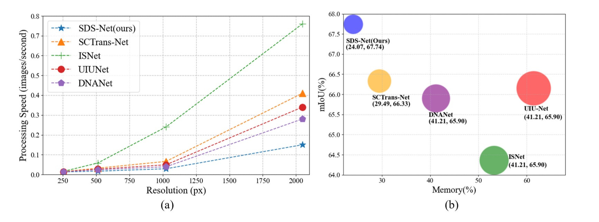

# [IEEE Trans. TGRS 2025] SDS-Net: Shallow-Deep Synergism-detection Network for Infrared Small Target Detection

## Overview

SDS-Net is a deep learning framework designed for infrared small target detection (IRSTD). The network employs a shallow-deep synergism strategy that effectively combines multi-scale features from different depths of the network to enhance detection performance.

## Main Features

- **Shallow-Deep Synergism Architecture**: Integrates features from both shallow and deep layers for better target-background discrimination
- **Multi-Scale Feature Fusion**: Utilizes MSCA (Multi-Scale Cross Attention) and MSSA (Multi-Scale Self Attention) modules
- **Deep Supervision**: Implements deep supervision during training for better convergence
- **Comprehensive Evaluation**: Supports multiple evaluation metrics including mIoU, nIoU, Pd, Fa, and F1-score

## Architecture

The SDS-Net architecture consists of:

1. **Backbone Network**: Feature extraction backbone with ResNet-style blocks
2. **Shallow Module**: Processes early-stage features with cross-attention mechanisms
3. **Deep Module**: Handles high-level semantic features with self-attention
4. **Fusion Blocks**: Combines features from different depths using ADSF (Adaptive Deep-Shallow Fusion)
5. **Multi-Scale Attention Mechanisms**: MSCA and MSSA for effective feature interaction

## Results

### Evaluation Metrics

The framework provides comprehensive evaluation metrics:

- **mIoU**: Mean Intersection over Union
- **nIoU**: Normalized IoU
- **Pd**: Probability of Detection
- **Fa**: False Alarm Rate
- **F1-score**: Harmonic mean of precision and recall

### Performance of efficiency and Memory consuming




## Supported Datasets

The framework supports multiple IRSTD datasets:

- **NUAA-SIRST** [[download]](https://github.com/YimianDai/sirst)
- **NUDT-SIRST** [[download]](https://github.com/YeRen123455/Infrared-Small-Target-Detection)
- **IRSTD-1K** [[download]](https://github.com/RuiZhang97/ISNet)
- **NUDT-SIRST-Sea** (for maritime target detection)
- **IRDST-real** (real-world infrared dataset)

## Usage

### 1. Environment Setup

#### Option A: Using pip with pyproject.toml (Recommended)

```bash
# Clone the repository
git clone https://github.com/PhysiLearn/SDS-Net.git
cd SDS-Net

# Create virtual environment (recommended)
python -m venv venv
source venv/bin/activate  # On Windows: venv\Scripts\activate

# Install the package with dependencies
pip install .

# Or install in editable mode for development
pip install -e .

```

#### Option B: Using conda (Alternative)

```bash
# Create conda environment
conda create -n sdsnet python=3.8
conda activate sdsnet

# Install PyTorch (adjust for your CUDA version)
conda install pytorch torchvision pytorch-cuda=11.8 -c pytorch -c nvidia

# Install other dependencies
pip install einops ml_collections thop
pip install scikit-image Pillow opencv-python
pip install tensorboard tqdm matplotlib
```

#### Option C: Manual Installation

```bash
# Install core dependencies
pip install torch torchvision
pip install einops ml_collections thop
pip install scikit-image Pillow opencv-python
pip install tensorboard tqdm matplotlib
```

### 2. Data Preparation

Organize your dataset in the following structure:

```
datasets/
├── NUAA-SIRST/
│   ├── images/
│   ├── masks/
│   └── img_idx/
│       ├── train_NUAA-SIRST.txt
│       └── test_NUAA-SIRST.txt
├── NUDT-SIRST/
│   ├── images/
│   ├── masks/
│   └── img_idx/
│       ├── train_NUDT-SIRST.txt
│       └── test_NUDT-SIRST.txt
└── IRSTD-1K/
    ├── images/
    ├── masks/
    └── img_idx/
        ├── train_IRSTD-1K.txt
        └── test_IRSTD-1K.txt
```

### 3. Training

#### Using the command-line entry point (after pip install):
```bash
sds-train --dataset_names ['NUDT-SIRST'] --model_names ['SDSNet'] --epochs 1000
```

#### Using the Python script directly:
```bash
python train.py --dataset_names ['NUDT-SIRST'] --model_names ['SDSNet'] --epochs 1000
```

**Key Arguments:**
- `--dataset_names`: List of datasets to train on
- `--model_names`: Model architecture (default: ['SDSNet'])
- `--batchSize`: Training batch size (default: 16)
- `--patchSize`: Training patch size (default: 256)
- `--epochs`: Number of training epochs (default: 1000)
- `--dataset_dir`: Dataset directory path (default: './datasets')
- `--save`: Checkpoint save path (default: './log')
- `--log_dir`: TensorBoard log directory (default: './otherlogs/SDSNet')

### 4. Testing

#### Using the command-line entry point (after pip install):
```bash
sds-test --dataset_names ['NUDT-SIRST'] --model_names ['SDSNet'] --pth_dirs ['NUDT-SIRST/SDSNet_673_best.pth.tar']
```

#### Using the Python script directly:
```bash
python test.py --dataset_names ['NUDT-SIRST'] --model_names ['SDSNet'] --pth_dirs ['NUDT-SIRST/SDSNet_673_best.pth.tar']
```

## Project Structure

```
SDS-Net/
├── model/
│   ├── SDSNet.py          # Main model architecture
│   └── Config.py          # Model configuration
├── images/                # Performance charts and visualizations
├── dataset.py             # Dataset loading utilities
├── train.py              # Training script
├── test.py               # Testing and evaluation script
├── metrics.py            # Evaluation metrics
├── utils.py              # Utility functions
├── warmup_scheduler.py   # Learning rate scheduling
├── pyproject.toml        # Modern Python project configuration
└── README.md             # This file
```

## Configuration

The model configuration is defined in `model/Config.py`:

```python
config = {
    'transformer': {
        'num_heads': 4,
        'num_layers': 4
    },
    'patch_sizes': [16, 8, 4],
    'base_channel': 32,
    'n_classes': 1
}
```


## Citation

If you find this work useful, please consider citing:

```bibtex
@article{SDSNet2025,
  title={SDS-Net: Shallow–Deep Synergism-Detection Network for Infrared Small Target Detection},
  author={Yue, Taoran and Lu, Xiaojin and Cai, Jiaxi and Chen, Yuanping and Chu, Shibing},
  journal={IEEE Transactions on Geoscience and Remote Sensing},
  volume={63},
  pages={1–13},
  year={2025},
  publisher={Institute of Electrical and Electronics Engineers (IEEE)},
  ISSN={1558-0644},
  DOI={10.1109/tgrs.2025.3588117},
  url={http://dx.doi.org/10.1109/tgrs.2025.3588117}
}
```

**Paper Title**: SDS-Net: Shallow-Deep Synergism-detection Network for Infrared Small Target Detection

## Contact

For questions or issues regarding SDS-Net, please contact the development team or open an issue on [GitHub](https://github.com/PhysiLearn/SDS-Net/issues).

## Acknowledgments

This implementation is inspired by recent advances in infrared small target detection and builds upon the following works:

- [IRSTD-Toolbox](https://github.com/XinyiYing/BasicIRSTD)
- [SCTransNet](https://github.com/xdFai/SCTransNet) 
- [UCTransNet](https://github.com/McGregorWwww/UCTransNet)
- [DNA-Net](https://github.com/YeRen123455/Infrared-Small-Target-Detection)
- [UIU-Net](https://github.com/danfenghong/IEEE_TIP_UIU-Net) 

## License

This project is released under the MIT License.
